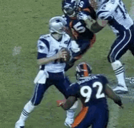

# nfl-ds-project
This repo contains work for the NFL DS takehome assessment for Swish Analytics.

In this repo we analyze Historical NFL game data.
We attempt to predict the probability that the next pass play will result in a sack.
Sacks can be a huge moment in NFL games where the momentum can totally shift or it can be the nail in the coffin.
Hence, there is a lot of motivation to be able to predict the likelihood of a sack occuring for both the offense, defense, and even the viewers experience which is the case in the context of Swish Analytics as they are providing data for sports betting platforms.

The data provided includes play by play information for all games in the 2021-2023 seasons.
Additionally there was metadata provided which contained information about team rosters in those same years, all nfl players of all time, depth charts, playing time information, and lastly advanced stats for defensive players, rushers, and passers.

Our analysis goes as follows
1. Assess the data
2. Build several predictive models, and finally
3. Compare and evaluate their performances against one another

In [this notebook](eda.ipynb) you will find the exploratory data analysis including plots and graphs, feature engineering, and code assembled in one place.

##### Data Dictionaries
The following data dictionaries were crucial in helping with the analysis:
* [Dictionary](https://nflreadr.nflverse.com/articles/dictionary_pbp.html)
* [Depth Chart Dictionary](https://nflreadr.nflverse.com/articles/dictionary_depth_charts.html)
* [Snap Counts Dictionary](https://nflreadr.nflverse.com/articles/dictionary_snap_counts.html)
* [Dictionary Rosters](https://nflreadr.nflverse.com/articles/dictionary_rosters.html)

Depicted above is a nice hard hitting sack of Tom Brady.